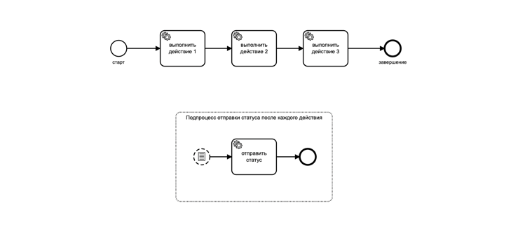
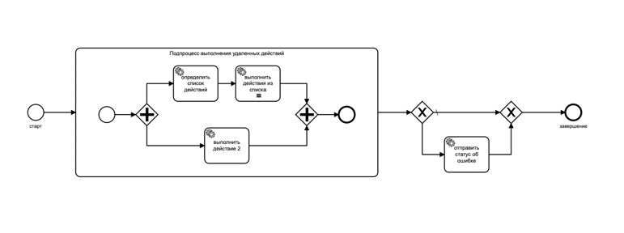
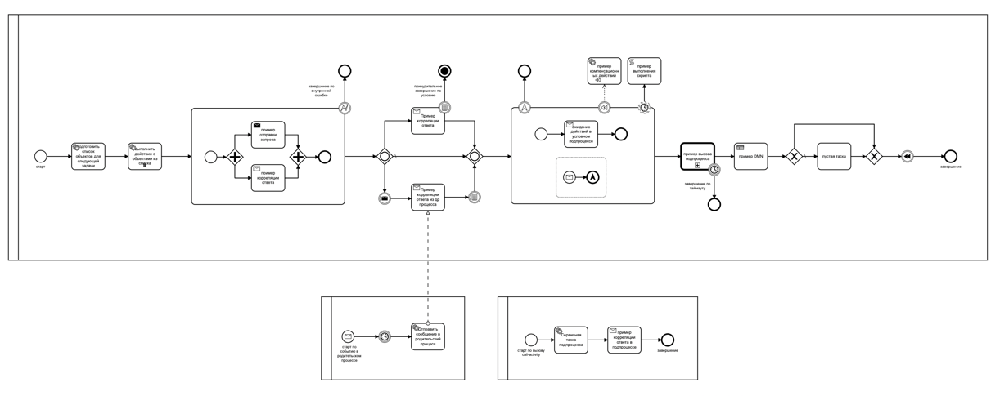

# camunda-useful-examples
get started + useful non-standard schemes

## 1 - Example of a process that performs an action without interrupting the parent process

## 2 - Example of a process that uses external tasks

## 3 - Example of a base process with common bpm elements

